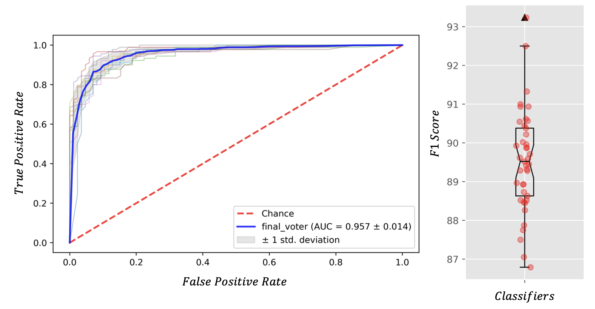
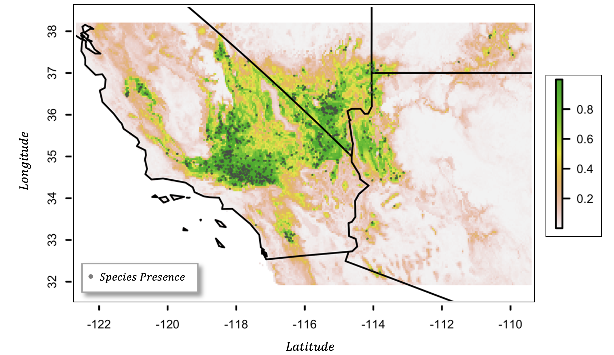

## PySDMs (Python Species Distribution Models). 

### Package Layout

* [PySDMs](https://github.com/daniel-furman/PySDMs/tree/main/src/PySDMs)/ - the library code itself
* [LICENSE](https://github.com/daniel-furman/PySDMs/blob/main/LICENSE) - the MIT license, which applies to this package
* README.md - the README file, which you are now reading
* [requirements.txt](https://github.com/daniel-furman/PySDMs/blob/main/requirements.txt) - prerequisites to install this package, used by pip
* [setup.py](https://github.com/daniel-furman/PySDMs/blob/main/setup.py) - installer script
* [tests](https://github.com/daniel-furman/PySDMs/tree/main/test)/ - unit tests

---

Example of PySDMs output:

Modeling Metrics| Geo-classification of Species Distribution
:---------------------------------:|:----------------------------------------:
 | 

### Longer Description:

An object-oriented class for Species Distribution Modeling (SDM).
    PySDMs does most of its heavy lifting in the modeling portion of the
    SDM framework, with the interpolate functions mainly packaging
    the geo-classification step in an object-oriented mannner. The pre-processing
    steps of a SDM workflow are left out, primarily because they are easier to
    do in R (see bib links at the end of the Jupyter notebook in examples/).

PySDMs was primarily developed for my research project on climate change
    impacts for Joshua tree and Desert Night Lizards.

Functions
-------

   self.fit(): Model training with PyCaret, considering tree-based
        methods, neural nets, and best-subset-selection soft voting blends.
        Requires a data-frame with a classification target and numerical
        explanatory features. Returns the voter with the best validation
        metric performance (default metric=F1).

   self.interpolate(): Geo-classification function for model interpolation to
        raster feature surfaces. Saves to file both probabilistic and binary
        distribution predictions.

   self.validation_performance(): F1 score and AUC visuals. Oriented for
        PySDMs workflows with multiple runs (see examples).
