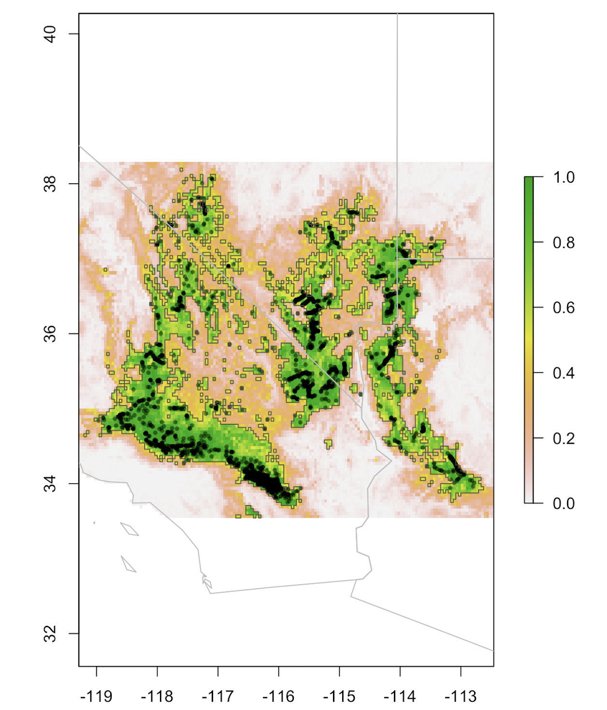

## PySDMs

---

## Example 1: "EcoRisk Forecasts - California" for DAT/Artathon 2021

 

### Descriptive Stats for Climatic Change at Species Presences:

Bioclimatic Variable  | Coast redwood % Change | Giant sequoia % Change | Joshua tree % Change
-----|-------|-------|-------
Temperature Annual Mean | +22% | +47% | +24%
Temperature Annual Range | +5% | +4% | +2%
Precipitation Driest Month | -1% | -2% | -7%

* SSP 370 [CMIP6](https://www.worldclim.org/data/cmip6/cmip6climate.html) models for the IPCC6 report.
* Bioclimatic Features from [WorldClim2](https://www.worldclim.org/data/worldclim21.html)
* Species presences from GBIF and carefully cleaned

 

## Example 2: Probablistic near-current interpolation

* Blending methods boosted model performances to ~ two-zero false negatives per species.

**Coast redwood** SDM geo-classification (*Sequoia sempervirens*) | Standard deviations from multiple seeds/samples. 
:---------------------------------:|:----------------------------------------:
 | 

**Giant sequioa** SDM geo-classification (*Sequoiadendron giganteum*) | Standard deviations from multiple seeds/samples.
:---------------------------------:|:----------------------------------------:
 | 

**Joshua tree** SDM geo-classification (*Yucca brevifolia*) | Standard deviations from multiple seeds/samples. 
:---------------------------------:|:----------------------------------------:
 | 

## Bio

An object-oriented Python class for semi-auto ML geo-classification (running on PyCaret). Compares gradient boosted tree algorithms by default, with options to include soft voters and NNs. Designed for Species Distribution Modeling applications.

## Package Layout

* [PySDMs](https://github.com/daniel-furman/PySDMs/tree/main/PySDMs)/ - the library code itself
* [LICENSE](https://github.com/daniel-furman/PySDMs/blob/main/LICENSE) - the MIT license, which applies to this package
* README.md - the README file, which you are now reading
* [requirements.txt](https://github.com/daniel-furman/PySDMs/blob/main/requirements.txt) - prerequisites to install this package, used by pip
* [setup.py](https://github.com/daniel-furman/PySDMs/blob/main/setup.py) - installer script
* [tests](https://github.com/daniel-furman/PySDMs/tree/main/test)/ - unit tests

## Functions

   **self.fit():** Model training with PyCaret, considering tree-based
        methods, neural nets, and best-subset-selection soft voting blends.
        Requires a data-frame with a classification target and numerical
        explanatory features. Returns the voter with the best validation
        metric performance (default metric=F1).

   **self.interpolate():** Geo-classification function for model interpolation to
        raster feature surfaces. Saves to file both probabilistic and binary
        distribution predictions.

   **self.validation_performance():** Metric scores and AUC visuals on the test set.

